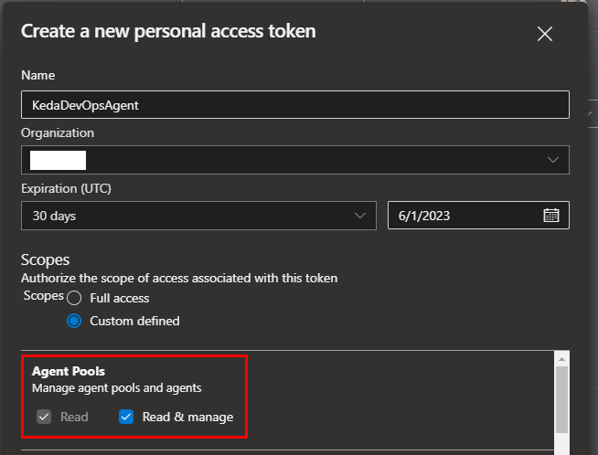

# Overview

This directory contains the scripts and docker files to create an image based on the most common build agent requirements.
It is meant to be deployed as a keda agent based on the 'agent.k8s.yaml' manifest that can be found in this directory as well.

# Prerequisites

The following resources/configurations need to be available before deploying this manifest:

- Azure Resources
  - Azure Container Registry
  - AKS Cluster (connected to the ACR)
- DevOps Configuration
  - ARM Service Connection
  - Docker Service Connection
  - Empty Agent Pool
  - Pipeline based on YAML
  - Personal Access Token (PAT)
## Azure Resources

### Container Registry

```
az acr create --resource-group myResourceGroup \
  --name mycontainerregistry --sku Basic
```

### AKS Cluster

The cluster needs to be connected to the ACR:

```
az aks update -n myAKSCluster -g myResourceGroup --attach-acr mycontainerregistry
```

## DevOps Service Connections

### ARM Service Connection


### Docker Service Connection


## DevOps Agent Pool

The agent pool should be called 'kedaagentlinux' for Linux or 'kedaagentwindows' for Windows images.
The agent pool can be a simple empty, self-hosted pool:


## DevOps Pipeline

 A DevOps pipeline pointing to your yaml file to automatically create the agent (see below).


## DevOps PAT

Finally, a Personal Access Token that is passed to the pipeline as a secret variable with the following access rights:



This PAT then needs to be configured as secret variable of the DevOps pipeline with the name 'azpToken' (see example files below):


# Critical capabilities

The following scripts are exectuted ahead of all other installer scripts (see below) in the specified order based on their dependencies:

1. 001-install-base-packages.sh: Installs the latest version of all required packages
2. 002-preimagedata.sh: Creates image information file
3. 003-configure-environment.sh: Creates image information file
4. 004-azure-cli.sh: Add Microsoft's GPG Key, apt pakcage source, and install Azure CLI
5. 005-powershellcore.sh: Install powershell core
6. 006-Install-PowerShellModules.ps1
7. 007-Install-AzureModules.ps1
8. 008-docker.sh: Install docker desktop

# Additional capabilities

- azcopy.sh: Installs AzCopy
- azure-devops-cli.sh: Installs Azure CLI DevOps module
- bicep.sh: Installs Bicep CLI
- dotnetcore-sdk.sh: Installs dotnet SDKs
- mono.sh: Installs mono runtime (dependency for dotnet/nuget on Linux)
- nodejs.sh: Install nvm, nodejs, and npm

# TODO:

- Add Windows keda agent
- Test additional pipelines to run on keda agent (esp. deployment pipelines)
- For docker jobs, move to image creation via ACR ([ACR build task](https://learn.microsoft.com/en-us/cli/azure/acr?view=azure-cli-latest#az-acr-run))
- Add option to store azToken in key vault
  - Replace PAT with Managed Identity once [this keda feature](https://github.com/kedacore/keda/issues/4072) has been implemented!
- Add bicep files to deploy AKS, ACR, and deployment script to create service connections?
- Replace manifest with helm!